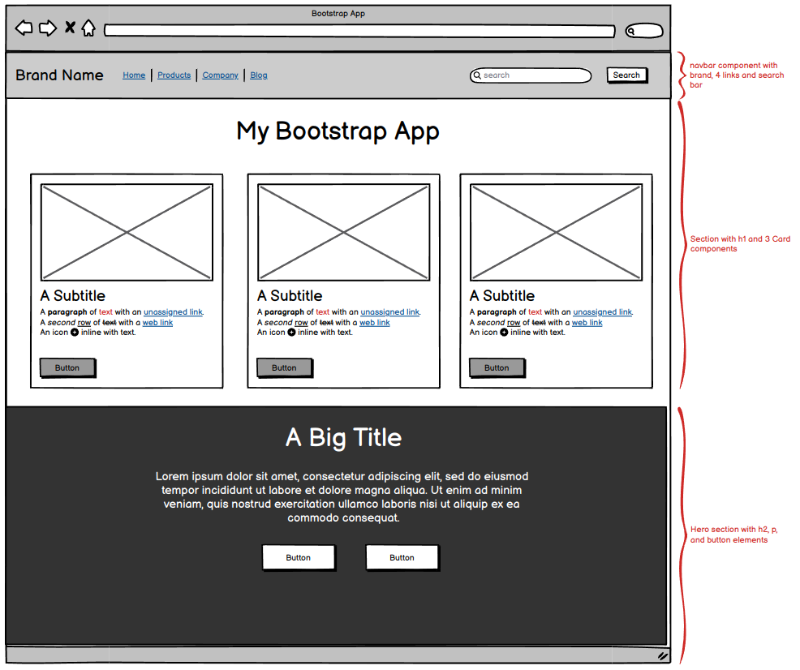

# Introduction to Bootstrap Demo

This project is designed for learners who are using Bootstrap for the first time and is a compliment to my coding demo; however, if you want to learn Bootstrap by jumping right in with a simple project, this is for you!  All you need is a basic understanding of HTML and CSS.

## What is Bootstrap?
Bootstrap is one of the oldest and most popular CSS frameworks.  Essentially, it is a collection of predefined classes with CSS styles and some JavaScript functions.  These classes then can be added to HTML elements to apply those styles. Bootstrap can be either imported into your project (via a CDN link) or installed with `npm` or other package manager.

The main selling point of Bootstrap is that whole, pre-styled components like navbars, dropdowns, buttons, cards, modals etc., can be easily added to your project by simply copy-pasting code from the documentation.  Additional utilities allow you add responsive layouts via grid and flexbox, and adjust things like margin and padding.

## Should I Use Bootstrap?
To answer this question, you'll need to think about the requirements and constraints of your project.  Do you:
* Want to prioritize ease of use and consistent styling?
* Only need a simple UI to showcase backend functionality?
* Have a short timeframe to finish your project?

These are good points *for* using Bootstrap.  But when is it **not** a good choice?
* You want a distinctive and complex UI/UX design
* You need to heavily customize CSS
* You only need one or two Bootstrap components
* Load times for large files/project structure are a concern

Again, determining your needs/needs of your client and reviewing what Bootstrap has to offer will help you decide if it's right for you.

## Using This Tutorial
I have adapted this tutorial from a live lesson and coding demo, so it is by no means complete. But I believe there is enough here to benefit anyone wanting to learn more about Bootstrap and decide to get started.  I will put some links to more resources at the end, should you want to continue your journey.

The real key to learning and using Bootstrap is navigating the documentation, and so that is the focus of this project.

Here is the wireframe for the steps below:

## Setup
* Create a new folder for your project called `bootstrap-app` with a new file called `index.html`
* Open your new folder in VS Code
* Open the [Bootstrap documentation](https://getbootstrap.com/docs/5.3/getting-started/introduction/) for reference

## Steps 
1. In `index.html`, create a boilerplate html page (hint: use emmet shortcut)
2. In between the `<body>` tags, add an `<h1>` with some example text
3. Start up Live Server in VS Code, and confirm that the example header is displayed
4. Find the Getting Started section in the documentation, and copy/paste the Bootstrap `<link>` and `<script>` elements into your `index.html`
5. In the navbar section of the documentation, copy/paste the code for a navbar with brand, links, and search bar to match the wireframe
6. Search in the documentation for the sections on text and margins, and adjust the position of the `<h1>` element using Bootstrap classes
7. Create a `<section>` element under the `<h1>`
8. Inside the new section, copy/paste 3 card components from the documentation that include all the same elements in the wireframe
9. Add a url to an image for each card (You can use https://placehold.co/) 
10. Review the section on flexbox styles in the docs, and apply flex to your section element to position the cards like the wireframe (you can use classes for flex, margin, gap, and padding to accomplish this)
11. Create a new `<section>` element below our card section for our hero
12. Go to https://getbootstrap.com/docs/5.3/examples/heroes/ and use the browser's dev tools to inspect the last hero to see what elements and classes were used 
13. Create an `<h2>`, `
`, and a `
` to hold the two buttons (Use VS Code or a [lorem ipsum generator](https://loremipsum.io/) to create filler text for the `
`)
14. Go back to the documentation on button components, and copy/paste 2 outline buttons in different colors within the `
`
15. Use the classes from the example in step 12 to style the elements in the hero
16. What else can you do?  Explore different components and utilities!

## Additional Resources
* The first of a 6-part series by The Net Ninja - [Bootstrap 5 Crash Course](https://youtu.be/O_9u1P5YjVc)
* A great tutorial on [Bootstrap's Grid System](https://youtu.be/Wqu-d_b3K-0)
* A quick guide to [CSS Flexbox](https://css-tricks.com/snippets/css/a-guide-to-flexbox/) (not Bootstrap specific, but always helpful!)

## Issues
If you find any problems, please create a pull request and I will review it as soon as I can.  
You can email me with questions at davidblarocco@gmail.com.

## Credits
&copy; 2023 by [David LaRocco](http://davidlarocco.dev), all rights reserved.